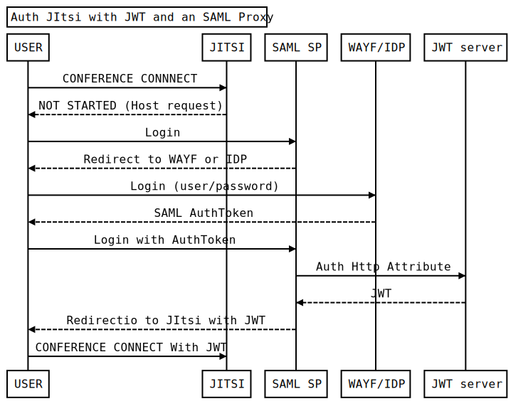

# Jitsi-SAML2JWT

Jitsi-SAML2JWT is a project to easily use SAML authentification with JWT, the new recommended Jitsi-Meet authentification mechanism. 


## Motivation

The legacy Shibboleth auth mechanism in Jitsi Jicofo will be removed by the Big Jitsi Auth Refactoring (see this [post](https://community.jitsi.org/t/intent-to-deprecate-and-remove-external-auth-mechanisms/115332)).

So to continue to use SAML with Jitsi, we need a independent system securised by SAML protocol to generate the JWT token.

## This project provides 2 things : 
 - Stand Alone JWT generator : a simple JWT generator written in PHP using authentification informations provided by an external SAML Proxy SP. 

 - A full running Docker file to deploy the token generator with a Shibboleth SAML SP because sometime it seems complex to deploy Shibboleth by hand.  

## Auhtentification Principle

The authentification call flow with a SAML SP and the JWT server looks like this : 




## Configuration Env variables
Before any installation you should create the .env file with your own informations. 
```
> mv .env_ref .env
```
Then edit the .env values.

```
#Shibboleth
ENABLE_SHIBBOLETH=true
SHIBBOLETH_TEMPLATE_XML=shibboleth2_sp_direct_idp.xml
SP_ENTITY_ID=jitsi-auth
METADATA_URL=http://saml2/idp/metadata
SSO_URL=http://saml2/idp/sso

#JWT Token Generator
JITSI_DOMAIN=my.jitsi.meet
JWT_GENERATOR_KEY=my_jitsi_app_secret
JWT_APP_ID=my_jitsi_app_id

#Web server
SERVER_NAME=jitsi-auth.meet
```

- `ENABLE_SHIBBOLETH` enable and install the local Shibooleth Service Provider.
- `SHIBBOLETH_TEMPLATE_XML` with shibboleth2.xml template to use (direct idp, with a discovery service or a prebuild federation one).
- `SP_ENTITY_ID` with the Identity of your SAML Service Provider.
- `METADATA_URL` with the remote SAML metadata information url (idp or provided by a federation). 
- `SSO_URL` with the target SAML SSO url for user redirection (idp or a discovery service). 

- `JITSI_DOMAIN` with the target Jitsi-Meet prosody virtual host. 
- `JWT_APP_SECRET` with prosody application secret known only to your token.
- `JWT_APP_ID` with prosody application identifier.
- `SERVER_NAME` with web server name of your token generator.

## Generate certificates 

We provide a script to generate selfsigned certificat for Apache and Shibboleth because SAML certificate auth needs to be share with IDP or federation Metadata.
```
> cd tools
> bash init_certificates.sh
```

## Stand Alone JWT generator
This instalaltion script supposed you run it on a debian like operarting system (Ubuntu >= 18 or Debian >= 11).
You can run init_certificates.sh before installing the jwt server or provide your own certificat for apache in the conf/cert/apache.pem file.

```
> cd tools
> bash install_jwtgenerator.sh
```


## Docker SAML SP and JWT Generator

Build Docker Image :
```
docker image build -t jitsisaml2jwt .
```

We also provide Docker image on DockerHub : [https://hub.docker.com/r/renater/jitisaml2jwt].

Start with docker compose : 
```
docker compose up -d
```

## SAML integration

You need to provide your sp-cert.pem and your Service Provider Metdata url (https://[SERVER_NAME]/Shibboleth.sso/SAML2/POST) informations to the remote IDP or Federation registry.


## Jitsi configuration to use JWT

With Jitsi-Meet Docker version : 
- Set `ENABLE_AUTH=1`, `AUTH_TYPE=jwt` and 
- Set `JWT_APP_SECRET`      with prosody application secret known only to your token.
- Set `JWT_APP_ID`  with prosody application identifier.
- To redirect from jitsi to login set the url of this container`TOKEN_AUTH_URL=https://[server_name]/redirectWithToken?room={room}`
- To redirect from jitsi to login with tenant set `TOKEN_AUTH_URL=https://[server_name]/generateToken?room={room}&subdir='+subdir+'`

If you don't use Docker version, check with community post [jitsi-meet-tokens-chronicles](https://community.jitsi.org/t/jitsi-meet-tokens-chronicles-on-debian-buster/76756/3).

## JItsi-SAML2JWT Request description

Sample request : 

https://[server_name]/getToken?room=Test&validity_timestamp=validity_timestamp=1674645573

Available request:

| Request                        | Description                                                                       | Return  | 
|--------------------------------|-----------------------------------------------------------------------------------|:--------|
| /redirectWithToken              | Redirect to the configured jitsi instance adding the JWT token in destination     |         |
| /getToken                       | Get a valid Token                                                                 |  string |

Available parameters:

| Key                            | Description                                                                                                                                  | Mandatory |    Type | Default value |
|--------------------------------|----------------------------------------------------------------------------------------------------------------------------------------------|:---------:|--------:|---------------|
| room                           | Restrict token to the specified room                                                                                                         |           |  string | *             |
| tenant                         | Restrict token and redirect to the specified teant                                                                                           |           |  string | empty         |
| validity_timestamp             | Set the max validity timlestamp of the JWT token zccording to https://www.rfc-editor.org/rfc/rfc7519#section-4.1.4 (0 for unlimited Token)   |           |  int    | 0             |